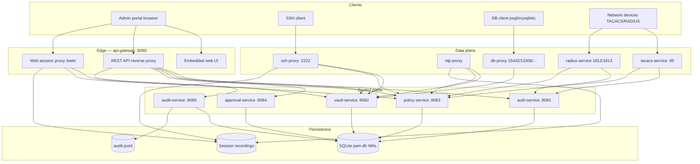
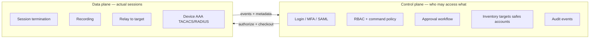
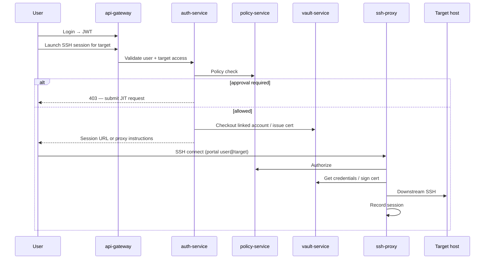
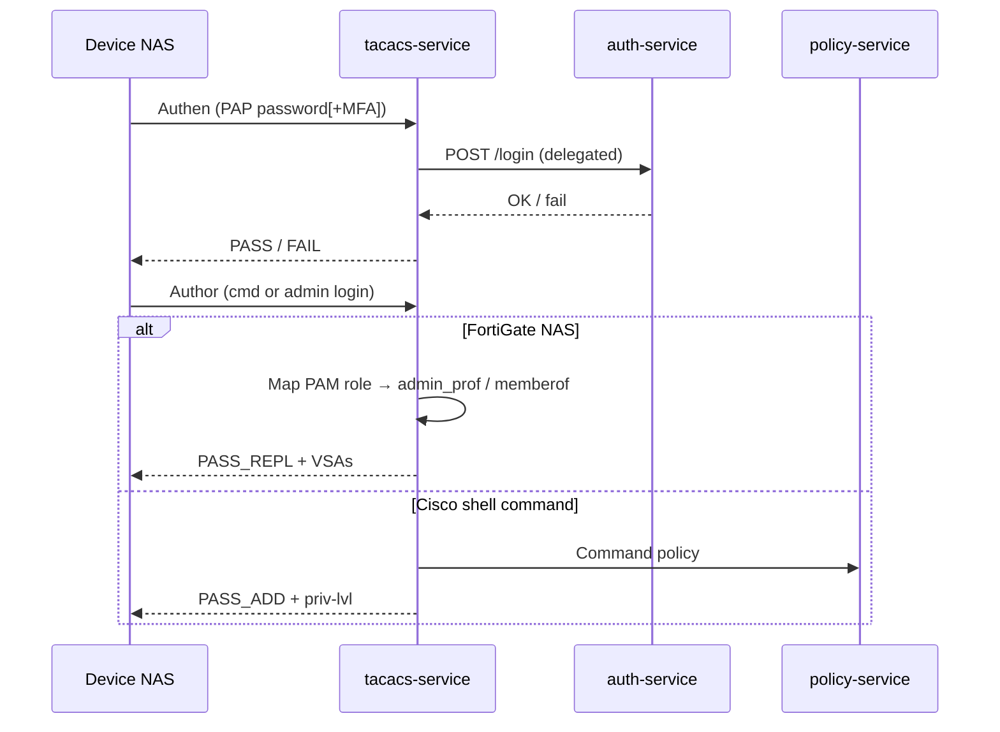
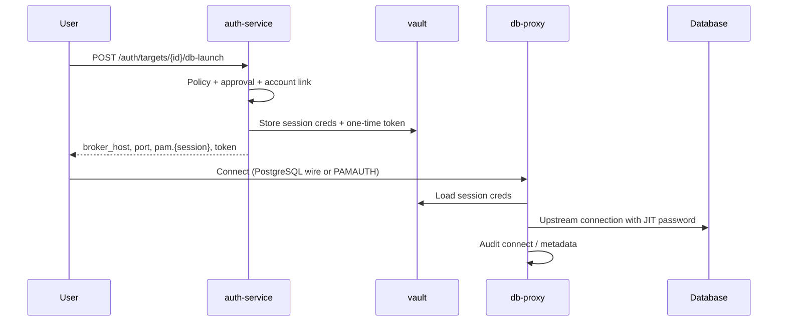
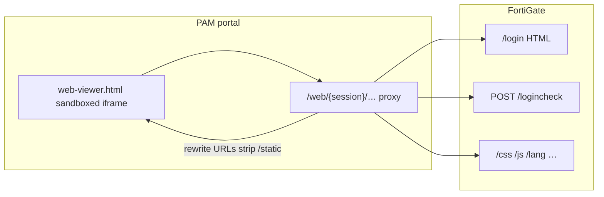
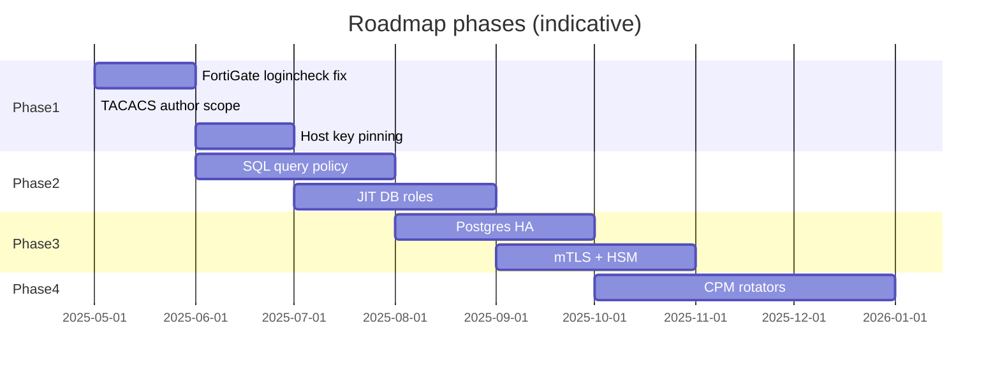

# PAM Platform — Architecture, Features & Roadmap

This document describes what is **implemented today**, how the platform is **architected**, and the **roadmap** for upcoming work. It complements the quick-start guide in [README.md](../README.md) and deployment notes in [deploy/docker/README.md](../deploy/docker/README.md).

> **Status:** Reference / lab-ready build. Cryptography, SSH handling, vault envelope encryption, and audit pipelines are real. Transport hardening (mTLS, HSM, HA Postgres) is documented under production gaps in the roadmap.

---

## Table of contents

1. [High-level architecture](#1-high-level-architecture)
2. [Control plane vs data plane](#2-control-plane-vs-data-plane)
3. [Service catalog](#3-service-catalog)
4. [Implemented features](#4-implemented-features)
5. [Access flows](#5-access-flows)
6. [Identity & directory integration](#6-identity--directory-integration)
7. [FortiGate web proxy](#7-fortigate-web-proxy)
8. [Database broker (Adaptive-style)](#8-database-broker-adaptive-style)
9. [Data model](#9-data-model)
10. [Deployment topology](#10-deployment-topology)
11. [Ports & configuration reference](#11-ports--configuration-reference)
12. [Roadmap](#12-roadmap)
13. [Known issues & in progress](#13-known-issues--in-progress)

---

## 1. High-level architecture



### Design principles

| Principle | How it shows up |
|-----------|-----------------|
| **Brokered access** | Users connect to PAM proxies/brokers, not directly to targets with standing passwords |
| **Policy everywhere** | SSH, RDP, web, TACACS, RADIUS, and DB paths consult the policy engine |
| **Vault-backed credentials** | Privileged passwords live in AES-256-GCM envelope encryption; checkout is audited |
| **JIT approval** | Time-bound access requests gate sensitive targets and dual-control safes |
| **Audit by default** | Events to SQLite + JSONL; session recordings for interactive protocols |
| **Microservice boundaries** | One binary per concern; gateway is the only public HTTP entry |

---

## 2. Control plane vs data plane



**Control plane** answers: *Is this user allowed? Do they need approval? Which role/profile applies? Which credential should be checked out?*

**Data plane** answers: *Open the connection, relay bytes, record the session, enforce per-command rules where implemented.*

---

## 3. Service catalog

| Service | Binary | Default port | Role |
|---------|--------|--------------|------|
| **api-gateway** | `cmd/api-gateway` | 8080 | Public HTTP/HTTPS, embedded UI, JWT gate, web proxy, RDP WS proxy |
| **auth-service** | `cmd/auth-service` | 8081 | Users, login, MFA, LDAP/AD, SAML, inventory API, launch endpoints |
| **vault-service** | `cmd/vault-service` | 8082 | Secrets, SSH CA, cert issuance, CCP API |
| **policy-service** | `cmd/policy-service` | 8083 | RBAC, command allow/deny, role matrix |
| **approval-service** | `cmd/approval-service` | 8084 | JIT access requests, TTL, approver workflow |
| **audit-service** | `cmd/audit-service` | 8085 | Queryable audit API, JSONL sink |
| **ssh-proxy** | `cmd/ssh-proxy` | 2222 | SSH bastion, downstream cert auth, recording |
| **rdp-proxy** | `cmd/rdp-proxy` | (internal) | Browser RDP via WebSocket |
| **db-proxy** | `cmd/db-proxy` | 15432, 13306, … | Wire-protocol DB broker |
| **tacacs-service** | `cmd/tacacs-service` | 49 | TACACS+ authentication & authorization |
| **radius-service** | `cmd/radius-service` | 1812/1813 UDP | RADIUS auth & accounting |
| **pam-cli** | `cmd/pam-cli` | — | Operator CLI utilities |

All services share one Docker image (`deploy/docker/Dockerfile`); Compose selects the binary via `command`.

---

## 4. Implemented features

### 4.1 Admin portal (embedded UI)

| Feature | Status | Notes |
|---------|--------|-------|
| Dashboard & navigation | ✅ | Targets, users, groups, roles, policies, audit |
| **Machines / targets** | ✅ | SSH, RDP, web URL, DB engines, network device kinds |
| **Locations** | ✅ | Group targets by site/datacenter |
| **Safes** | ✅ | Credential containers with dual-control & CPM flags |
| **Privileged accounts** | ✅ | Linked to targets; checkout, rotate, break-glass |
| **Applications (CCP)** | ✅ | API-key access to `GET /api/ccp/accounts` |
| **Integrations catalog** | ✅ | Adaptive-style DB/cloud/K8s integration picker |
| **Access requests (JIT)** | ✅ | Submit, approve, deny, TTL |
| **Session viewer** | ✅ | SSH terminal in browser, RDP viewer, web viewer |
| **Settings** | ✅ | LDAP, SAML, TACACS Fortinet mapping, threat stubs |
| **Reports / threats** | 🟡 | UI scaffolding; limited backend |

### 4.2 Authentication & authorization

| Feature | Status | Notes |
|---------|--------|-------|
| Local users (Argon2id) | ✅ | Default `admin / admin` for lab |
| JWT (HS256) | ✅ | Gateway validates bearer tokens |
| MFA (TOTP) | ✅ | Append code to password (FortiGate: no space) |
| **LDAP / Active Directory** | ✅ | Bind, search, optional periodic sync |
| **SAML SSO** | ✅ | SP metadata, ACS, login redirect |
| RBAC (roles + groups) | ✅ | Role matrix in UI |
| Command-level policy | ✅ | Per-target allow/deny patterns |
| JIT approval gates | ✅ | Policy + dual-control safes |

### 4.3 Vault & credentials

| Feature | Status | Notes |
|---------|--------|-------|
| Envelope encryption (AES-256-GCM) | ✅ | `PAM_MASTER_KEY` |
| Privileged account storage | ✅ | Per-safe, per-target linkage |
| Checkout / check-in audit | ✅ | Who saw which password when |
| SSH CA (Ed25519) | ✅ | Short-lived downstream certs |
| CPM rotation hooks | 🟡 | Schedule fields + manual rotate; full rotator integrations planned |
| Break-glass | ✅ | Emergency checkout with elevated audit |

### 4.4 Session protocols

| Protocol | Status | Recording | Policy |
|----------|--------|-----------|--------|
| **SSH (browser)** | ✅ | ✅ | ✅ |
| **SSH (native via proxy)** | ✅ | ✅ | ✅ |
| **RDP (browser)** | ✅ | ✅ | ✅ |
| **Web (generic HTTPS)** | ✅ | ✅ | ✅ |
| **Web (FortiGate)** | 🟡 | ✅ | ✅ — see [§7](#7-fortigate-web-proxy) |
| **PostgreSQL broker** | ✅ | Metadata | ✅ |
| **MySQL / Redis / others** | 🟡 | Metadata | ✅ — PAMAUTH handshake + broker ports |

### 4.5 Network AAA (devices)

| Feature | Status | Vendors / notes |
|---------|--------|-----------------|
| **TACACS+ auth** | ✅ | Cisco, Arista, FortiGate, … |
| **TACACS+ author** | ✅ | Command auth + FortiGate admin VSAs |
| **FortiGate profile mapping** | ✅ | `admin_prof`, `memberof` from PAM role |
| **RADIUS auth/acct** | ✅ | HP/Aruba, MikroTik, Juniper, Palo Alto, F5, … |
| Per-NAS RADIUS secrets | ✅ | `radius_clients` table |
| Vendor-specific RADIUS attrs | ✅ | Based on target `kind` |

### 4.6 Audit & compliance

| Feature | Status | Notes |
|---------|--------|-------|
| Structured audit events | ✅ | SQLite + JSONL |
| Session recordings | ✅ | SSH/RDP/web under `PAM_REC_DIR` |
| TACACS/RADIUS logging | ✅ | Published to event bus |
| DB query events table | ✅ | Schema ready; deep SQL parsing planned |
| SIEM export | 🟡 | JSONL file; Kafka/NATS swap planned |

### 4.7 Operations

| Feature | Status | Notes |
|---------|--------|-------|
| Docker Compose deploy | ✅ | `deploy/docker/docker-compose.yml` |
| Health checks | ✅ | Per-service `/health` or port checks |
| Kubernetes manifests | 🟡 | Minimal samples in `deploy/k8s/` |
| `pam-cli` | ✅ | Operator tasks |

**Legend:** ✅ shipped · 🟡 partial · ⬜ planned (see roadmap)

---

## 5. Access flows

### 5.1 SSH (browser or native)



**Native SSH:** `ssh -p 2222 user@target-name@localhost`

**Passthrough mode:** When no privileged account is linked, the proxy may forward portal credentials — device must accept them (TACACS on device or local user).

### 5.2 RDP (browser)

User launches from Machines → gateway opens WebSocket to `rdp-proxy` → credentials from vault → session recorded.

### 5.3 Web launch (generic + FortiGate)

1. `POST /auth/targets/{id}/web-launch` — policy, approval, vault checkout.
2. Gateway creates a **web session** with upstream URL and optional Basic Auth.
3. Browser loads `web-viewer.html?session=…` → iframe to `/web/{session}/…`.
4. Gateway rewrites HTML/JS/CSS URLs, strips frame-busters, proxies `fetch`/XHR/forms.

See [§7](#7-fortigate-web-proxy) for FortiOS-specific behavior.

### 5.4 TACACS+ (network device → PAM)



**FortiGate device config (summary):** TACACS server pointing at PAM, `authen-type pap`, authorization enabled, remote admin template with `accprofile-override`.

### 5.5 RADIUS

UDP/1812 authentication and UDP/1813 accounting. Device-specific vendor attributes emitted from target `kind`. Per-NAS secrets in `radius_clients`.

### 5.6 Database broker



User **never** receives the raw DB password in the launch response — only broker endpoint + session identity + one-time token.

---

## 6. Identity & directory integration

### 6.1 LDAP / Active Directory

Configured in **Settings → LDAP** (stored in `settings` table, bind password in vault).

| Capability | Status |
|------------|--------|
| LDAP bind + user search | ✅ |
| Group membership sync | ✅ |
| Scheduled sync (`PAM_LDAP_SYNC_INTERVAL`) | ✅ |
| Login via AD credentials | ✅ |
| FortiGate UPN vs sAMAccountName | ✅ TACACS resolves email → portal user |

### 6.2 SAML SSO

| Capability | Status |
|------------|--------|
| SP metadata (`/api/auth/saml/metadata`) | ✅ |
| Login redirect | ✅ |
| ACS POST | ✅ |
| SSO status endpoint | ✅ |

### 6.3 MFA

TOTP enforced when `PAM_REQUIRE_MFA=1` or per-user enrollment. For FortiGate TACACS, append the 6-digit code to the password with **no space**.

---

## 7. FortiGate web proxy

FortiOS admin GUI is delivered through PAM so the browser bar stays on the portal and sessions are recorded.

### Architecture



### Implemented mitigations

| Problem | Mitigation |
|---------|------------|
| Frame-buster redirects top window | `fortinetProxyBridgeScript()` hooks `location`, `fetch`, XHR, forms |
| Assets under wrong path (`/login/static/…`) | MIME-mismatch retry; cache `assetStrip=/static` per session |
| `web_url` ending in `/login` | `isApplianceEntryPath()` — don't double-prefix upstream paths |
| Silent fallback to raw firewall URL | Removed — launch failure surfaces in UI |

### TACACS vs web

| Path | Identity |
|------|----------|
| **TACACS** to FortiGate | Portal user + MFA → `admin_prof` / `memberof` |
| **Web proxy** | Vault privileged account or form login on FortiGate UI |
| **SSH to FortiGate** | Same as other SSH targets |

### TACACS author fix (Cisco regression)

Previously `service=administration` on **any** NAS triggered FortiGate VSAs, breaking Cisco shells. Author logic now applies FortiGate attributes only when:

- NAS IP is a registered FortiGate in inventory, **or**
- TACACS `service=` explicitly names FortiOS (`fortigate`, `fortinet`, …).

Cisco/HP devices with `service=shell` use standard command authorization again.

---

## 8. Database broker (Adaptive-style)

Inspired by brokered database access products (e.g. [Adaptive](https://adaptive.live/)): users connect to PAM, not to standing DB credentials.

### Components

| Path | Purpose |
|------|---------|
| `cmd/db-proxy/main.go` | Multi-port broker listener |
| `internal/dbproxy/` | PostgreSQL wire protocol; generic `PAMAUTH` for other engines |
| `internal/dblaunch/launch.go` | `POST /auth/targets/{id}/db-launch` |
| `internal/inventory/dbconn.go` | Engine types: postgres, mysql, mssql, mongodb, redis, oracle |
| Portal **Integrations** tab | Catalog + launch UX |

### Broker ports (default)

| Engine | Host port |
|--------|-----------|
| PostgreSQL | 15432 |
| MySQL | 13306 |
| MSSQL | 11433 |
| MongoDB | 27018 |
| Redis | 16379 |
| Oracle | 11521 |

Set `PAM_DB_BROKER_HOST` on auth-service to the IP/hostname **clients** use to reach the broker (important when DB clients run outside Docker).

### Current gaps (roadmap)

- SQL statement parsing and deny rules (DROP, TRUNCATE, …)
- JIT DB role creation on connect / disconnect
- Full wire support for all engines (MySQL/Oracle native protocol depth)
- CPM rotators per engine (CyberArk-style)

---

## 9. Data model

Primary store: **SQLite** (`PAM_DB`) with WAL — Postgres-compatible schema for future migration.

| Area | Key tables |
|------|------------|
| Identity | `users`, `groups`, `roles`, `user_groups`, `role_permissions` |
| Inventory | `targets`, `locations`, `target_groups` |
| Credentials | `safes`, `privileged_accounts`, `checkouts` |
| Policy | `policies`, `policy_rules`, `access_matrix` |
| JIT | `access_requests` |
| AAA | `radius_clients` |
| Sessions | `sessions`, web session state (gateway memory + vault) |
| DB audit | `db_query_events`, `targets.db_name` |
| Settings | `settings` (LDAP, SAML, Fortinet maps JSON) |
| Audit | `audit_events` + `PAM_AUDIT_JSONL` file |

---

## 10. Deployment topology

### Docker Compose (recommended lab / single-node)

```text
Host
├── pam-gateway:8080          ← Admin UI + API
├── pam-auth:8081
├── pam-vault:8082
├── pam-policy:8083
├── pam-approval:8084
├── pam-audit:8085
├── pam-ssh-proxy:2222
├── pam-db-proxy:15432,13306,16379,…
├── pam-tacacs:49
├── pam-radius:1812/udp,1813/udp
├── pam-rdp-proxy (internal)
├── volume pam-data            ← pam.db
└── volume pam-rec             ← recordings
```

**Typical server deploy** (`/opt/lkpam`):

```bash
git pull
docker compose -f deploy/docker/docker-compose.yml build --no-cache gateway auth tacacs db-proxy
docker compose -f deploy/docker/docker-compose.yml up -d gateway auth tacacs db-proxy
```

Put passwords containing `$` in `deploy/docker/secrets.env` (not `.env`) so Compose does not expand them.

### Network placement

| Traffic | Direction |
|---------|-----------|
| Admins | → :8080 (HTTPS in production) |
| SSH users | → :2222 |
| DB clients | → broker ports on PAM host |
| Switches/firewalls | → :49 TACACS, :1812/:1813 RADIUS |
| LDAP | auth-service → AD/LDAP |
| Targets | data-plane services → target IPs |

---

## 11. Ports & configuration reference

### External ports (defaults)

| Port | Service |
|------|---------|
| 8080 | Portal + API |
| 2222 | SSH proxy |
| 49 | TACACS+ |
| 1812/udp | RADIUS auth |
| 1813/udp | RADIUS accounting |
| 15432 | PostgreSQL broker |
| 13306 | MySQL broker |
| 16379 | Redis broker |

### Important environment variables

| Variable | Purpose |
|----------|---------|
| `PAM_DB` | SQLite (or Postgres) DSN |
| `PAM_JWT_SECRET` | Portal JWT signing |
| `PAM_MASTER_KEY` | Vault encryption key (32 bytes base64) |
| `PAM_REC_DIR` | Session recordings directory |
| `PAM_TACACS_SECRET` | TACACS shared secret |
| `PAM_TACACS_FORTINET_*` | Role → `admin_prof` / `memberof` maps |
| `PAM_RADIUS_SECRET` | Global RADIUS fallback secret |
| `PAM_DB_BROKER_HOST` | Hostname/IP shown to DB clients |
| `PAM_LDAP_SYNC_INTERVAL` | AD sync period |
| `PAM_REQUIRE_MFA` | Force MFA on login |

Full list: `internal/config` and [README.md](../README.md#configuration).

---

## 12. Roadmap

### Phase 1 — Stabilize current paths (near term)

| Item | Priority | Description |
|------|----------|-------------|
| FortiGate `logincheck` POST | **P0** | Fix HTML error on credential POST (path, cookies, body forwarding) |
| TACACS author regression | **P0** | FortiGate VSAs scoped to FortiGate NAS only ✅ (in tree) |
| Web proxy test matrix | P1 | PAN-OS, F5, generic appliance entry paths |
| Host key pinning | P1 | Replace `InsecureIgnoreHostKey` in SSH proxy |
| HttpOnly session cookies | P1 | Replace localStorage JWT in UI |

### Phase 2 — Database & cloud (Adaptive parity)

| Item | Description |
|------|-------------|
| SQL query policy | Parse and deny/allow statements; populate `db_query_events` |
| JIT DB roles | Create/drop DB user on broker connect/disconnect |
| Native MySQL/MSSQL wire | Full protocol in db-proxy |
| Snowflake / BigQuery brokers | HTTPS/SQL API relay pattern |
| Kubernetes exec broker | `kubectl`-less portal launch |
| Integration connectors | Terraform provider, CI/CD secret fetch |

### Phase 3 — Enterprise hardening

| Item | Description |
|------|-------------|
| Postgres HA | Patroni / managed RDS; migrate from SQLite |
| HSM-backed master key | PKCS#11 / CloudHSM |
| mTLS internal mesh | Istio or manual service certs |
| OPA policy engine | Replace inline Rego-ready policy |
| Kafka/NATS audit bus | Multiple SIEM/UEBA consumers |
| RadSec + TACACS TLS | Encrypt AAA transports |
| UEBA / threat rules | Wire threats tab to real detectors |

### Phase 4 — UX & operations

| Item | Description |
|------|-------------|
| CPM rotators | Scheduled password change on targets (SSH, WinRM, API) |
| Session replay UI | Parse recordings in portal |
| Multi-tenant orgs | Separate namespaces / RBAC boundaries |
| Mobile-friendly approvals | Push / email approver links |
| High-availability gateway | Multiple gateway replicas + sticky sessions |



---

## 13. Known issues & in progress

| Issue | Symptom | Workaround / status |
|-------|---------|---------------------|
| FortiGate web `logincheck` | POST returns generic HTML `<h1>Error</h1>` | Use TACACS admin login to FortiGate directly; web proxy login under investigation |
| TACACS slow on first auth | Delay before PASS | Normal if LDAP/auth-service cold-start; user confirmed working after wait |
| SSH without linked account | Message: use Privileged Account or configure TACACS | Link account in Safes **or** point device TACACS at PAM |
| `web_url` with `/login` suffix | Asset path confusion | Prefer root URL `https://fw/`; gateway strips `/static` when detected |
| Reference build security | Dev JWT secret, no mTLS | Do not expose to untrusted networks without hardening (Phase 3) |

---

## Related documents

- [README.md](../README.md) — Quick start, RADIUS examples, project layout
- [deploy/docker/README.md](../deploy/docker/README.md) — Compose, secrets, health checks
- [policies/example.rego](../policies/example.rego) — Future OPA policy bundle

---

*Last updated: May 2025 — reflects FortiGate web proxy, DB broker (`db-proxy`), Integrations tab, and TACACS author scoping.*
